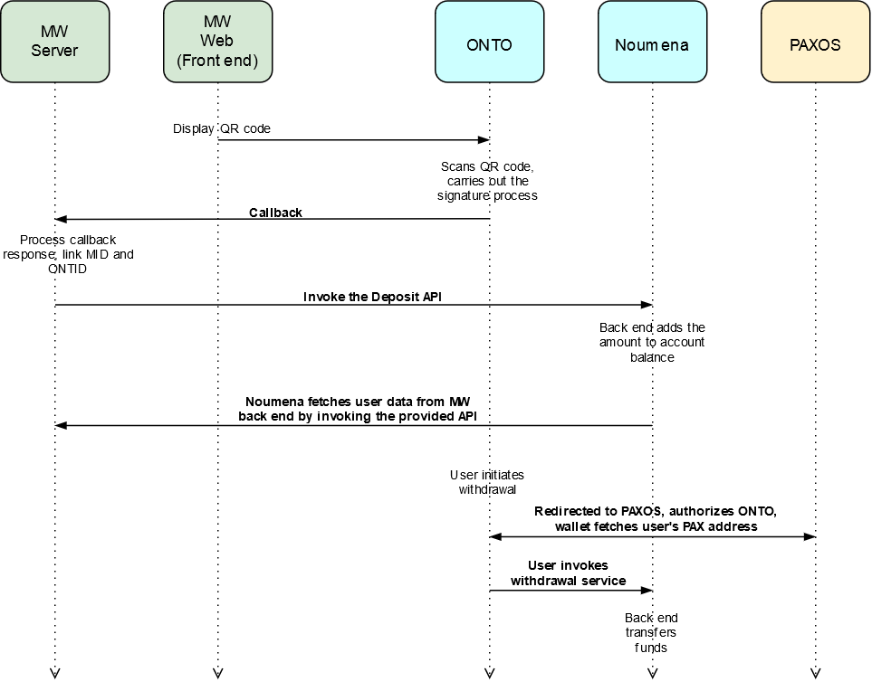

## Preface

This document contains an outline of integrating the **ONTO** platform with the **Microworkers** platform to allow interaction between the **Microworkers** back end and **ONTO**, along with it's respective services.

## Data Exchange Process Flow



The process involves three major steps. Microworkers platform is actively involved in the first two. The process is as follows-

1. **ONTO**(https://onto.app/) scans the QR code and links the `MID` to `ONTID`
2. **Microworkers** back end invokes the `Noumena` deposit `API` to transfer the amount specified by the user in the **withdrawal request**
3. User withdraws the amount from **ONTO**

## Prerequisites

**Microworkers** back end applies for the `Appkey` and `Secret` from `Noumena` (User Acceptance Test: http://uat.noumena.pro )

### Data structures

### 1. ONTO scans QR code, links MID to ONTID

The QR code displayed on the **Microworkers** web platform contains the following data-

```json
{
    "action": "login",
    "version": "v1.0.0",
    "id": "10ba038e-48da-487b-96e8-8d3b99b6d18a",
    "params": {
        "type": "ontid",
        "dappName": "dapp Name",
        "dappIcon": "dapp Icon",
        "message": "mid+cointype+amount+timestamp+nonce",
        "expire": 1581562747,
        "callback": "http://101.132.193.149:4027/blockchain/v1/common/test-onto-login"
    }
```
> `MID` is the Microworker `ID` of the user

| Field | Type | Description |
| ----- | ---- | ----------- |
| action | string | Describes the function of QR code, default value for login action is `login` |
| id | string | Message serial no. (optional) |
| type | string | Default value `ontid` if logging in using ONT ID, `address` if logging in using a wallet address |
| dappName | string | dApp name |
| dappIcon | string | dApp icon resource URI |
| message | string | Randomly generated message used for identity verification, Microwoker `userid` + `cointype` + `amount` + `timestamp` + `nonce`, Example: `1234+PAX+10+1578395085+3535`|
| expire | long | UNIX timestamp of the expiration time |
| callback | string | The callback `URL` to send the response to Microworkers back end after signing the user's QR code scanning action |

ONTO invokes Microworkers callback `API` after the user enters password in ONTO and sends the signature data. The data structures is as follows-

```json
POST

{ 
    "action": "login",
    "version": "v1.0.0",
    "id": "10ba038e-48da-487b-96e8-8d3b99b6d18a",
    "params": {
        "type": "ontid",
        "user": "did:ont:AUEKhXNsoAT27HJwwqFGbpRy8QLHUMBMPz",
        "message": "mid+cointype+amount+timestamp+nonce",
        "publickey": "0205c8fff4b1d21f4b2ec3b48cf88004e38402933d7e914b2a0eda0de15e73ba61",
        "signature": "01abd7ea9d79c857cd838cabbbaad3efb44a6fc4f5a5ef52ea8461d6c055b8a7cf324d1a58962988709705cefe40df5b26e88af3ca387ec5036ec7f5e6640a1754"
    }
}
```

Microworkers back end recives the message, verifies the signature, and records the MID and ONTID binding link.

* java verifies the signature： https://github.com/ontio/ontology-java-sdk/blob/master/docs/en/interface.md#verify-signature
* ts   verifies the signature： https://github.com/ontio/ontology-ts-sdk/blob/master/test/ecdsa.crypto.test.ts

Verification code example：
```

<!-- https://mvnrepository.com/artifact/com.github.ontio/ontology-sdk-java -->
<dependency>
    <groupId>com.github.ontio</groupId>
    <artifactId>ontology-sdk-java</artifactId>
    <version>1.0.13</version>
</dependency>

class Result {
    public String action;
    public long error;
    public String desc;
    public Object result;
    public String version;
}

Map param = (Map)reqObj.get("params");
String user = (String)param.get("user");
String message = (String)param.get("message");
String publickey = (String)param.get("publickey");
String signature = (String)param.get("signature");
com.github.ontio.account.Account acct0 = new com.github.ontio.account.Account(false, Helper.hexToBytes(publickey));
boolean b = acct0.verifySignature(message.getBytes(), Helper.hexToBytes(signature));
String address = Address.addressFromPubKey(publickey).toBase58();
if(!address.equals(user.replace("did:ont:",""))){
    result.error = 1;
    result.desc = "user error";
    return result;
}
if(b){
    result.result = true;
}else {
    result.result = false;
}
```

Response if the verification succeeds:

```json
{
  "action": "login",
  "id": "10ba038e-48da-487b-96e8-8d3b99b6d18a",
  "error": 0,
  "desc": "SUCCESS",
  "result": true
}
```

Response if the verification fails:

```json
{
  "action": "login",
  "id": "10ba038e-48da-487b-96e8-8d3b99b6d18a",
  "error": 80001,
  "desc": "PARAMS ERROR",
  "result": {}
}
```

### 2. Microworkers backend invokes NoumenaPay API to deposit the withdrawal amount

This deposit `API` is invoked when a user issues a withdrawal request on the **Microworker** web platform. 

- Request:

```text
URL: http://uat.noumena.pro/api/v1/npay/cust/transaction
Method: POST

-H 'Access-Passphrase: 12345678a' 
-H 'Authorization: Noumena:cdb780f1afc64e57a32928608b78cb11:123' 
-H 'Content-Type: application/json' 
```

```json
{
  "acct_no": "ont:did:AUEKhXNsoAT27HJwwqFGbpRy8QLHUMBMPz",
  "cust_user_no": "mid-2323",
  "cust_tx_id": "12346", 
  "coin_type": "PAX",
  "tx_amount": "1.01",
  "bonus_tx_amount": "1.001",
  "bonus_coin_type": "ONT",
  "remark": ""
}
```
- Response: 

```
{
  "code": 0,
  "msg": "SUCCESS"
  "result": {
		"tx_id": "202001120001",
		"bonus_txid": "202001120002"
    }
}

```


| Body_Field_Name |  Type  |   Description   |
|:----------:|:------:|:---------------------------------------------------------------------:|
|   acct_no | String |ontid|
|   cust_user_no | String |user id in microwokers|
|   cust_tx_id | String |order id|
|   coin_type | String |coin type|
|   tx_amount | String |amount|
|   bonus_coin_type | String |bonus coin type|
|   bonus_tx_amount | String |bonus amount|
|   remark | String |description |


- Request：

```text
URL：/api/v1/npay/cust/transaction
Method：GET
```

|  Field_Name   |  Type  |        Description         |
| :-----------: | :----: | :------------------------: |
|  page_num   | int  |    page number     |
|  page_size  | int  |  page size   |
|  acct_no  | String  |  ontid   |
|  cust_user_no  | String  | user id in microwokers |
|  cust_tx_id  | String  | order id   |

- Response：

```json
	{
	  "code": 0,
	  "msg": "SUCCESS",
	  "result": {
		"records": [
		  {
			"acct_no": "12345678",
			"bonus": "10",
			"bonus_coin_type": "ONT",
			"create_time": 0,
			"cust_user_no": "mid123",
			"cust_tx_id":"1",
			"coinType":"PAX",
			"tx_amount": "126"
		  }
		],
		"total": 0
	  }
	}
```

|  Field_Name   |  Type  |        Description         |
| :-----------: | :----: | :------------------------: |
|    acct_no    | String | ontid |
| bonus | String | bonus |
| bonus_coin_type | String | bonus coin type |
|  create_time   | long |      create time   |
|    cust_user_no    |  String   |   user id in microwokers          |
|    cust_tx_id    |  String   |   order id          |
|  coin_type   | String |      coin type   |
|  tx_amount   | String |      amount   |

> It is important to note that **ONTO** needs and maintains a record of only the withdrawal amount that the user decides to withdraw using **ONTO**, and not the the total balance or other account related information.


**Microworkers** backend platform provides work experience related data to be displayed in **ONTO**. **ONTO** queries the following data from **Microworkers** API:

```text
URL: http://api.microwokers.com/api/v1/user/{user ontid}
Method: GET
```

```json

Response：
{
   "user": "did:ont:AUEKhXNsoAT27HJwwqFGbpRy8QLHUMBMPz",
   "name": "user name", 
   "score": "5",
   "current_balance": "100",
   "total_rewards": "1000",
   "label":  "Java Python"

}

```

```name```: User account name

```score```: A rating measure for the user (score)

``` current_balance```: Current balance

```total_rewards```: Total Microwroker reward

```label```: A label that serves as a direct indicator of performance


|  Field_Name   |  Type  |        Description         |
| :-----------: | :----: | :------------------------: |
|    user    | String | ontid|
| name | String | User account name |
| score | String | A rating measure for the user (score) |
|  current_balance   | String |      Current balance   |
|  total_rewards   | String |      Total Microwroker reward   |
|  label   | String |      A label that serves as a direct indicator of performance   |

### 3. ONTO user withdrawal

> To withdraw the amount using PAXOS the user needs to provide the PAX account address. It is possible to carry out a transaction only when the user registers a PAXOS acouent and then authorizes ONTO to use it.

