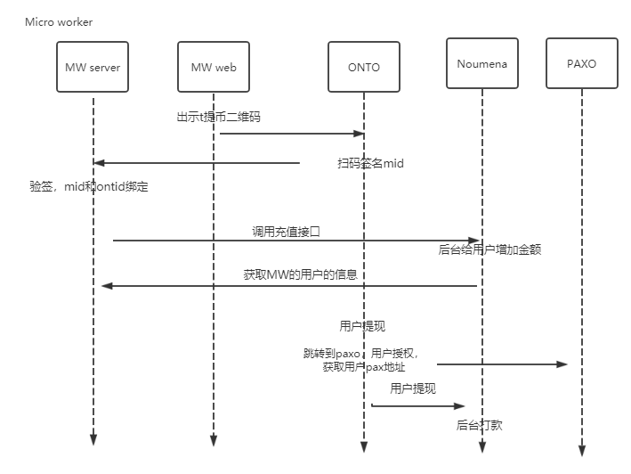

# micro workers 对接


流程图：



主要分3个步骤，MW只需要完成前两个步骤：
1. ONTO(https://onto.app/) 扫描, 绑定mid和ontid
2. MW后台调用Noumena Pay充值接口给用户充值
3. 用户在 ONTO 提现（未完成）

### 准备条件

WM 在Noumena( http://uat.noumena.pro )申请 Appkey 和 Screte。在执行第二步操作时需要使用。

### 1. ONTO 扫描, 绑定mid和ontid：


MW web显示二维码，二维码可以是json数据也可以是链接地址（如 http://101.132.193.149/files/microwoker.json ）。内容如下
```
{
    "action": "login",
    "version": "v1.0.0",
    "id": "10ba038e-48da-487b-96e8-8d3b99b6d18a",
    "params": {
        "type": "ontid",
        "dappName": "dapp Name",
        "dappIcon": "dapp Icon",
        "message": "mid+cointype+amount+timestamp+nonce",  // signature message：microwoker userid + cointype + amount + timestamp + nonce. example: 1234+PAX+10+1578395085+3535
        "expire": 1581562747, // QR Code expire time
        "callback": "http://101.132.193.149:4027/blockchain/v1/common/test-onto-login"
    }
}


```

> mid是用户在 MW的id

 字段 | 类型 | 描述 
-----|---------|----------
action	|string	|定义此二维码的功能，登录设定为 "Login"，调用智能合约设定为 "invoke"
id	|string	|消息序列号，可选
type	|string	|定义是使用ontid登录设定为 "ontid"，钱包地址登录设定为 "address"
dappName	|string	|DAPP 名字
dappIcon |	string	|DAPP icon 信息
message	|string	|随机生成，用于校验身份
expire	|long|	可选
callback	|string	|用户扫码签名后发送到 DAPP 后端 URL
 
ONTO 用户输入密码后，ONTO 调用 micro woker 的 callback接口，发送签名数据，内容如下：
```
POST  callback

{
    "action": "login",
    "version": "v1.0.0",
    "id": "10ba038e-48da-487b-96e8-8d3b99b6d18a",
    "params": {
        "type": "ontid",
        "user": "did:ont:AUEKhXNsoAT27HJwwqFGbpRy8QLHUMBMPz",
        "message": "mid+cointype+amount+timestamp+nonce",
        "publickey": "0205c8fff4b1d21f4b2ec3b48cf88004e38402933d7e914b2a0eda0de15e73ba61",
        "signature": "01abd7ea9d79c857cd838cabbbaad3efb44a6fc4f5a5ef52ea8461d6c055b8a7cf324d1a58962988709705cefe40df5b26e88af3ca387ec5036ec7f5e6640a1754"
    }
}
```
WM 后台收到信息，验证签名，如果成功记录 mid 和ontid 的绑定关系。

* java 验证签名： https://github.com/ontio/ontology-java-sdk/blob/master/docs/en/interface.md#verify-signature
* ts   验证签名： https://github.com/ontio/ontology-ts-sdk/blob/master/test/ecdsa.crypto.test.ts

验证签名例子：

```

<!-- https://mvnrepository.com/artifact/com.github.ontio/ontology-sdk-java -->
<dependency>
    <groupId>com.github.ontio</groupId>
    <artifactId>ontology-sdk-java</artifactId>
    <version>1.0.13</version>
</dependency>

class Result {
    public String action;
    public long error;
    public String desc;
    public Object result;
    public String version;
}

Map param = (Map)reqObj.get("params");
String user = (String)param.get("user");
String message = (String)param.get("message");
String publickey = (String)param.get("publickey");
String signature = (String)param.get("signature");
com.github.ontio.account.Account acct0 = new com.github.ontio.account.Account(false, Helper.hexToBytes(publickey));
boolean b = acct0.verifySignature(message.getBytes(), Helper.hexToBytes(signature));
String address = Address.addressFromPubKey(publickey).toBase58();
if(!address.equals(user.replace("did:ont:",""))){
    result.error = 1;
    result.desc = "user error";
    return result;
}
if(b){
    result.result = true;
}else {
    result.result = false;
}
```


验证签名成功：
```
{
  "action": "login",
  "id": "10ba038e-48da-487b-96e8-8d3b99b6d18a",
  "error": 0,
  "desc": "SUCCESS",
  "result": true
}
```

验证签名失败：
```
{
  "action": "login",
  "id": "10ba038e-48da-487b-96e8-8d3b99b6d18a",
  "error": 80001,
  "desc": "PARAMS ERROR",
  "result": {}
}
```

### 2. MW后台调用NoumenaPay充值接口给用户充值


用户在MW网站提交提币申请时，MW后台调用Noumena Pay的充值接口。
```

POST  /api/v1/npay/transaction

{

  "acct_no": "ont:did:AUEKhXNsoAT27HJwwqFGbpRy8QLHUMBMPz",
  "cust_user_no": "mid-2323",
  "cust_tx_id": "12346", 
  "coin_type": "PAX",
  "tx_amount": "1.01",
  "bonus_tx_amount": "1.001",
  "bonus_coin_type": "ONT",
  "remark": ""
}

Response: 

{
  "code": 0,
  "msg": "SUCCESS"
  "result": {
		"tx_id": "202001120001",
		"bonus_txid": "202001120002"
    }
}

```


| Body_Field_Name |  Type  |   Description   |
|:----------:|:------:|:---------------------------------------------------------------------:|
|   acct_no | String |要充值的用户编号|
|   cust_user_no | String |机构端用户编号(机构端唯一)|
|   cust_tx_id | String |机构端交易流水号(可以空)|
|   coin_type | String |充值的币种|
|   tx_amount | String |充值金额|
|   bonus_coin_type | String |奖励币种(可以为空)|
|   bonus_tx_amount | String |奖励币种金额(bonus_coin_type为空则可以为空,否则不能为空)|
|   remark | String |备注(可以空)|

查询充值记录：

```text
url：/api/v1/npay/cust/transaction
method：GET
```

- 请求：

|  Field_Name   |  Type  |        Description         |
| :-----------: | :----: | :------------------------: |
|  page_num   | int  |    页数     |
|  page_size  | int  |  页的大小   |
|  acct_no  | String  |  onto 用戶账号(可选)   |
|  cust_user_no  | String  | 绑定公司下用户编号(可选)   |
|  cust_tx_id  | String  | 绑定公司下交易号(可选)   |

- 响应：

```json
	{
	  "code": 0,
	  "msg": "SUCCESS",
	  "result": {
		"records": [
		  {
			"acct_no": "12345678",
			"bonus": "10",
			"bonus_coin_type": "ONT",
			"create_time": 0,
			"cust_user_no": "mid123",
			"cust_tx_id":"1",
			"coinType":"PAX",
			"tx_amount": "126"
		  }
		],
		"total": 0
	  }
	}
```

|  Field_Name   |  Type  |        Description         |
| :-----------: | :----: | :------------------------: |
|    acct_no    | String | 机构端用户编号(机构端唯一) |
| bonus | String | 奖励 |
| bonus_coin_type | String | 奖励币种 |
|  create_time   | long |      创建日期   |
|    cust_user_no    |  String   |   绑定公司下用户编号          |
|    cust_tx_id    |  String   |   绑定公司下交易号          |
|  coin_type   | String |      币种   |
|  tx_amount   | String |      金额   |

#### 查询用户信息（microwokers支持）

WM提供查询用户信息的查询接口，用于ONTO页面展示,例如：
```
GET http://api.microwokers.com/api/v1/user/{user ontid}

```

```json

Response：
{
   "user": "did:ont:AUEKhXNsoAT27HJwwqFGbpRy8QLHUMBMPz",
   "name": "user name", 
   "score": "5",
   "current_balance": "100",
   "total_rewards": "1000",
   "label":  "Java Python"

}

```

|  Field_Name   |  Type  |        Description         |
| :-----------: | :----: | :------------------------: |
|    user    | String | ontid|
| name | String | 用户的账户名 |
| score | String | 用户的星级评分 |
|  current_balance   | String |      账户余额   |
|  total_rewards   | String |      总共获得的酬劳   |
|  label   | String |      能力标签   |

### 3. 用户在 ONTO 提现（未完成）


> 提现需要用户提供PAXO的PAX地址，用户先授权才能获取到用户的PAX地址。如果用户还没注册PAXO，需要先注册，才能授权。

